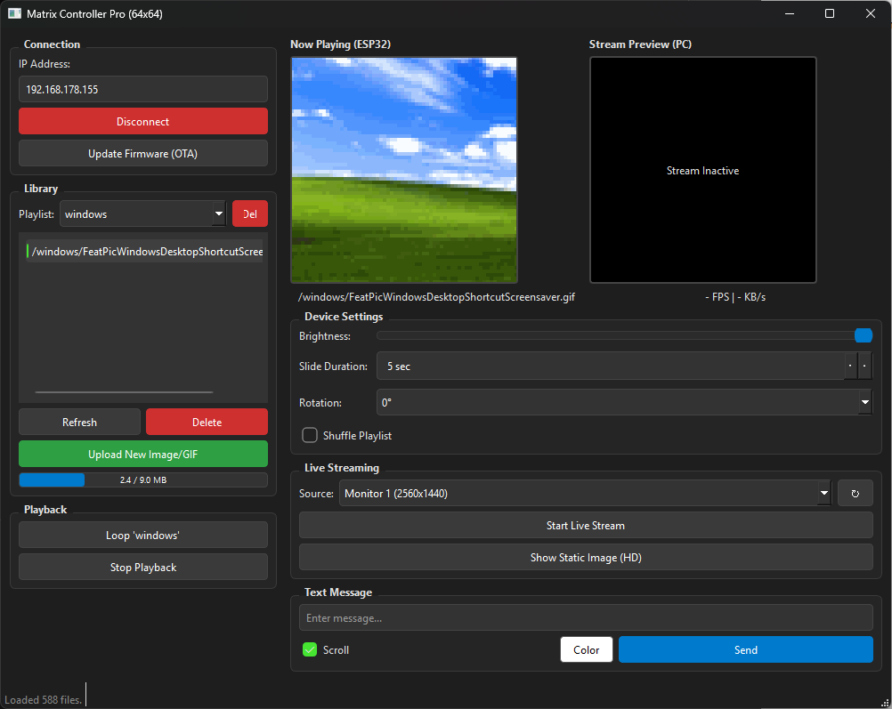
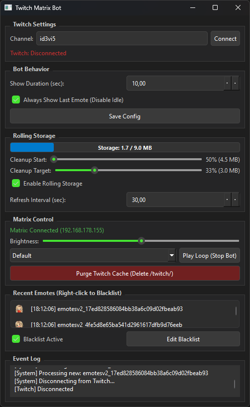
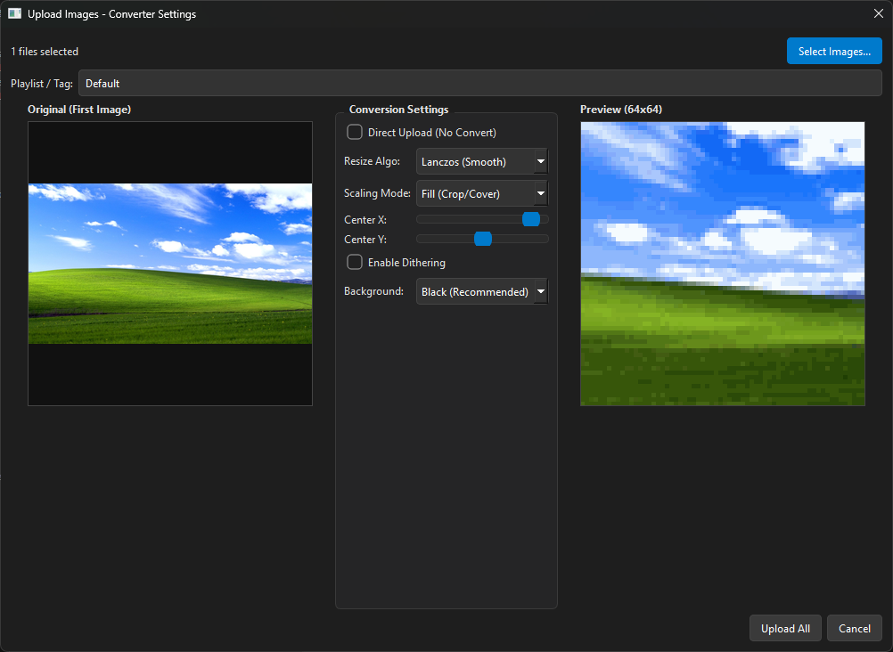

# ESP32-S3 RGB Matrix Ecosystem

This project is a complete ecosystem for controlling a **64x64 HUB75 RGB LED Matrix** using an **ESP32-S3**. It combines high-performance firmware with PSRAM-backed GIF playback and a modern desktop application for control and automatic image conversion.

## 🚀 Features

### Firmware (ESP32-S3)
*   **High-Performance Playback:** Utilizes the ESP32-S3's OPI PSRAM to pre-load entire animations for glitch-free playback, eliminating SD/Flash bottlenecks.
*   **Smart Playlist System:** Supports subfolders as playlists. Play specific folders or loop through everything.
*   **Shuffle Mode:** Randomize playback order within any playlist.
*   **Web Technology:** Integrated Async WebServer for file uploads/management and WebSockets for low-latency real-time control.
*   **Robust Stability:** Includes anti-starvation logic for network tasks and safety delays for corrupt files.
*   **LittleFS:** Efficient file management on the 16MB Flash memory.

### Desktop Client (Python & PyQt6)

*   **Smart Auto-Converter:** Drag & drop PNG, JPG, BMP, or GIFs. The client automatically resizes, crops, and converts them into optimized 64x64 GIFs with a unified palette for maximum compatibility.
*   **Advanced Live Stream:** Stream your PC monitor or windows with extremely low latency. Includes **live settings** (⚙) to adjust cropping, scaling (Fit/Fill/Stretch), and dithering in real-time.
*   **Remote Management:** List files, delete images, or **delete entire playlists** directly from the UI.
*   **Real-Time Control:** Adjust brightness, rotation, playback speed, and toggle shuffle mode instantly.
*   **Text Mode:** Send scrolling text messages with custom colors.

### 🎮 Twitch Integration (New!)

A standalone GUI application (`client/twitch_emotes.py`) connects your matrix to Twitch Chat.
*   **Emote Support:** Displays native Twitch, **7TV**, **FrankerFaceZ (FFZ)**, and **BetterTTV (BTTV)** emotes automatically.
*   **GUI Control:** Live preview of events, brightness control, and manual playlist override.
*   **Rolling Storage:** Automatic space management (LRU). Define a cleanup threshold (e.g., 80%) and target (e.g., 50%) to delete old emotes when space runs low.
*   **Smart Caching:** Downloads emotes once and caches them on the ESP32 (in `/twitch/` folder) to save bandwidth. Auto-refreshes storage stats.
*   **Customization:** Adjust display duration and idle behavior directly in the app.
*   **Setup:** Copy `client/config.json.example` to `client/config.json` and enter your credentials.

### Home Automation (MQTT)
*   **Home Assistant Integration:** Fully controllable via MQTT.
*   **Auto-Discovery:** Automatically creates entities in Home Assistant for brightness, power, and playlist selection.
*   **Remote Control:** Change playlists, loop specific files, or adjust brightness remotely.
*   **Status Updates:** Reports current file, playlist, and device status in real-time.

## 🛠 Hardware Setup

### Components
*   **ESP32-S3** (Recommended: N16R8 version with 16MB Flash / 8MB OPI PSRAM).
*   **64x64 RGB LED Matrix** (HUB75 interface).
*   **External 5V Power Supply** (Minimum 4A recommended).

### Wiring (Default Pin-Mapping)
Configured in `src/Config.h`. Matches standard libraries for ESP32-S3:

| Signal | GPIO | Signal | GPIO |
| :--- | :--- | :--- | :--- |
| **R1** | 42 | **A** | 4 |
| **G1** | 41 | **B** | 5 |
| **B1** | 40 | **C** | 6 |
| **R2** | 38 | **D** | 7 |
| **G2** | 39 | **E** | 15 |
| **B2** | 13 | **LAT** | 17 |
| **CLK** | 16 | **OE** | 1 |

*> Note: B2 is mapped to GPIO 13 to avoid conflicts with PSRAM on some boards.*

## 💻 Installation & Setup

### 1. Firmware (PlatformIO)
1.  Open the project folder in VS Code with **PlatformIO**.
2.  **Configuration:**
    *   Rename `src/Secrets_example.h` to `src/Secrets.h`.
    *   Enter your WiFi and **MQTT credentials** in `src/Secrets.h`.
    *   (Optional) Adjust MQTT topics in `src/Config.h`.
3.  Connect your ESP32-S3 via USB.
4.  Click **PlatformIO: Upload** to flash the firmware.
5.  (Optional) Click **Upload Filesystem Image** to initialize LittleFS (wipes existing files).

### 2. Desktop Client
1.  Navigate to the `client/` directory.
2.  Install dependencies (Python 3.x required):
    ```bash
    pip install -r requirements.txt
    ```
3.  Run the application:
    ```bash
    python main.py
    ```

## 📖 How to Use
1.  **Connect:** Enter the ESP32's IP address (shown in Serial Monitor) and click "Connect".
2.  **Upload:** Click "Upload New Image/GIF".
    
    *   Select multiple files.
    *   Enter a "Playlist / Tag" name (this creates a folder on the ESP32).
    *   The client handles resizing and conversion automatically.
3.  **Playback:**
    *   Select a playlist from the dropdown.
    *   Click **Loop 'PlaylistName'** to play all files in that folder.
    *   Check **Shuffle Playlist** for random order.
4.  **Live Stream:** Select a monitor or window source and click "Start Live Stream" to mirror your screen to the matrix.

## ⚠️ Important Notes
*   **PSRAM is Critical:** This code is optimized for boards with OPI PSRAM. Without PSRAM, you may face memory issues with large animations.
*   **Power Supply:** Never power the matrix solely through the ESP32's USB port. High brightness can draw significant current and damage the controller.

---
*Built for the Open Source Community.*